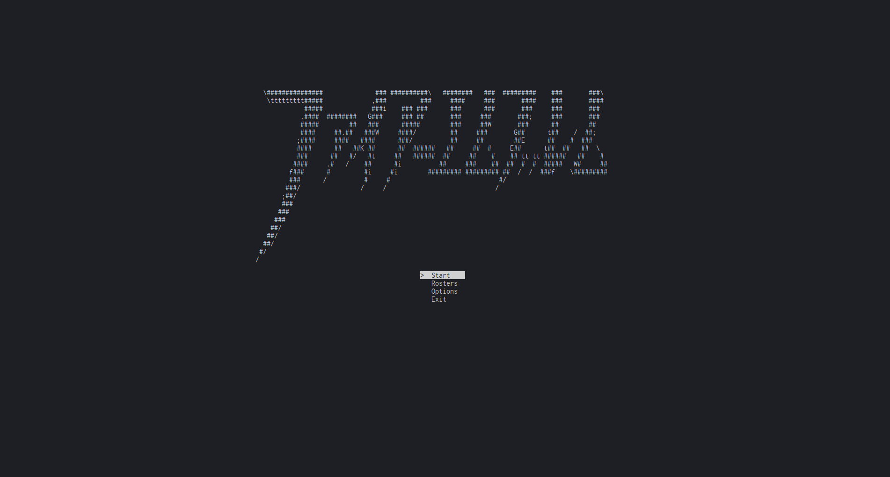
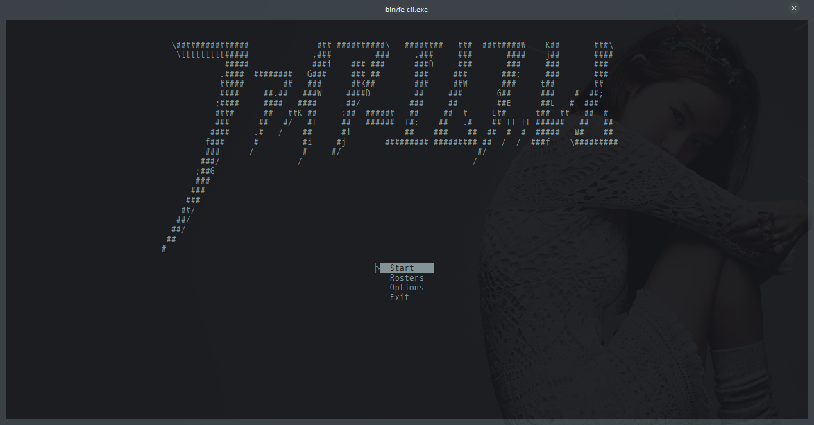
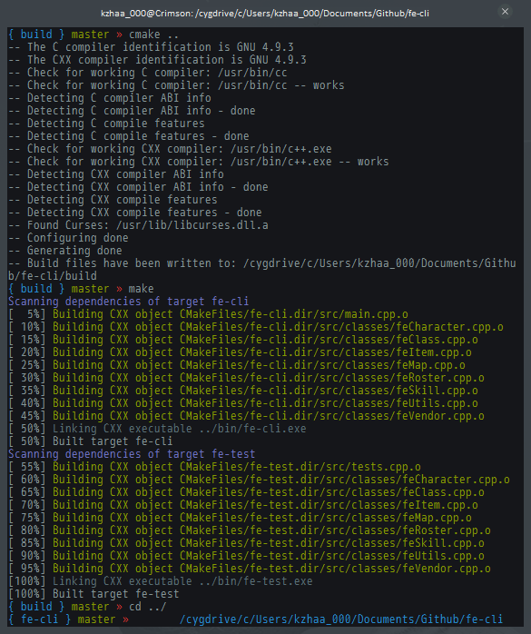

fe-cli
------

FE-CLI puts the Fire Emblem tactical RPG gameplay in your terminal! Built for extensibility, flexibility, and faithfulness to the originals.
Read the docs for more information.

requirements
------------

 * CMake 2.8+
 * ncurses
 * a lot of terminal real estate

build & install
---------------

### *nix



Make sure you have the latest ncurses development library and CMake 2.8 or higher.

```
$ git clone https://github.com/chocolatemelt/fe-cli.git
$ cd fe-cli
$ mkdir build && cd build
$ cmake ..
$ make
```

### windows



The only supported building system for Windows currently requires Cygwin with ncurses-devel and CMake 2.8 or higher. It's preferred to use the cygwin package for CMake but with some tweaking the Windows binary will also work.

[Babun](http://babun.github.io/) is an easy way to get set up if you haven't yet already; just run ```pact install ncurses cmake``` and you should be good to go!

Building through the terminal is the exact same as *nix systems; just run the above commands. If everything went well, your terminal should look something like this:



controls
--------

 * WASD - move
 * Arrow keys - move
 * Enter - select
 * Tab - open menu
